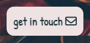

<h1 align="center">notPub Quiz</h1>

Welcome to the notPub Quiz! If you ever get bored of playing cards or the time it takes to set up a board game, look no further. With this online quiz you can test your knowledge of a range of subjects and compare how well you do with friends. Just like a pub quiz but anywhere and anytime you want!

<a href="https://elliethurlwell.github.io/project2-notPubQuiz/index.html" target="_blank">View the live project here.</a>

<h2 align="center"></h2>

## User Experience (UX)

-   ### User stories

    -   #### First Time Visitor Goals

        1. As a First Time Visitor, I want to be able to enjoy playing an interesting online quiz.
        2. As a First Time Visitor, I want to be able to easily navigate throughout the quiz site.
        3. As a First Time Visitor, I want to be able to understand the site enough to recommend it to friends.

    -   #### Returning Visitor Goals

        1. As a Returning Visitor, I want to remember the interface and use the site intuitively.
        2. As a Returning Visitor, I want to be able to see my score and try to better it.
        3. As a Returning Visitor, I want to be able to know the site well enough to explain it to friends.
        4. As a Returning Visitor, I want to be able to contact the site owner if necessary.

-   ### Design
    -   #### Colour Scheme
        -   The main colours used across the site are a warm beige as a background and a bold dark grey that allows the text to stand out. The six category buttons each have their own background colour, making it clear that they are different and independent of each other. A green and a red accent on selected answers uses known colour connotations to differentiate correct and incorrect.
    -   #### Typography
        -   Quicksand is the main font used throughout the website with Sans Serif as the fallback font. Quicksand is clean, simple, and easy to read, appropriate for the site's purpose. Categories and possible answers are easy to read. Patrick Hand is the font for titles and headings with Cursive as the fallback font. It is fun and resembles handwriting, linking back to the traditional handwritten pub quiz. It is also clear and easily readable.
    -   #### Imagery
        -   Imagery is secondary on this site and should not detract from its main purpose. As such the background image is fairly simple and not too busy so as not to become the focus. It depicts a typical pub interior with tables and chairs in the foreground, reminiscent of usual pub quiz surroundings.
       

*   ### Wireframes

    -   Wireframes for desktop and mobile view, for both the homepage and quiz page.
    <h2 align="center"></h2>

## Features

-   Responsive across a variety of screen sizes

-   Interactive elements throughout

-   Elements that are responsive to user inputs

-   localStorage implemented to display the user's score

## Technologies Used

### Languages Used

-   [HTML5](https://en.wikipedia.org/wiki/HTML5)
-   [CSS3](https://en.wikipedia.org/wiki/Cascading_Style_Sheets)
-   [JavaScript](https://en.wikipedia.org/wiki/JavaScript)

### Frameworks, Libraries & Programs Used

- [Google Fonts:](https://fonts.google.com/)
    - Google fonts were used to import the 'Patrick Hand' and 'Quicksand' fonts into the style.css file.
- [Font Awesome:](https://fontawesome.com/)
    - Font Awesome was used to add title icon, to create the favicon, and for the contact button.
- [W3Schools](https://www.w3schools.com/)
    - W3Schools tutorials were used to inform JavaScript functions.
- [Git](https://git-scm.com/)
    - Git was used for version control by utilizing the Gitpod terminal to commit to Git and Push to GitHub.
- [GitHub:](https://github.com/)
    - GitHub is used to store the project's code after being pushed from Git.
- [Balsamiq:](https://balsamiq.com/)
    - Balsamiq was used to create the wireframes during the design process.

## Testing

The W3C Markup Validator and W3C CSS Validator Services were used to check validity of code used throughout the project.

-   [W3C Markup Validator](https://validator.w3.org/#validate_by_input) - errors on both html files for elements not being allowed to be children of certain other elements
    - Despite the errors, the code currently remains the same. It is being used for layout purposes and an alternative method was not yet found. This would be fixed in any later releases of the site.
-   [W3C CSS Validator](https://jigsaw.w3.org/css-validator/#validate_by_input) - no errors found
-   [JSHint](https://jshint.com/) - certain syntax is only available in ES6, otherwise no errors found
-   [Lighthouse](https://developers.google.com/web/tools/lighthouse) - Performance: 99, Accessibility: 100, Best Practices: 100, SEO: 100.

### Testing User Stories from User Experience (UX) Section

-   #### First Time Visitor Goals

    1. As a First Time Visitor, I want to be able to enjoy playing an interesting online quiz.

        - Upon entering the site, users are greeted with clear instructions of how to begin playing. 
        - On desktop the available options on both the home page and quiz page have hover effects to catch the user's attention.
        - The choice of question categories provides options depending on how the user would enjoy playing at that moment.
    <h2 align="center"></h2>

    2. As a First Time Visitor, I want to be able to easily navigate throughout the quiz site.

        - The site contains clearly defined buttons with either hover effects or pointer cursors to be recognisable to the user.
        - Once a category has been chosen the site moves through a set of questions automatically, so the user can focus on playing the quiz.
        - The quiz page has a button to return to the categories and a button to quit the game should the user choose to. 
    <h2 align="center"></h2>

    3. As a First Time Visitor, I want to be able to understand the site enough to recommend it to friends.

        - The interface is approachable and easy to navigate.
        - Each category game is structured the same way, making it easy to understand quickly.
    

-   #### Returning Visitor Goals

    1. As a Returning Visitor, I want to remember the interface and use the site intuitively.

        - All elements are clearly laid out and in an understandable layout for ease of use.
        - The different quiz categories use the same format during the game, allowing a user to play any of them easily even if they only have experience of one. 
    <h2 align="center"></h2>

    2. As a Returning Visitor, I want to be able to see my score and try to better it.

        - While playing the quiz the user's current score is displayed above the question.
        - Once they have answered all the questions a modal displays their final score, in green for clarity.
        - When the user returns to the home page to choose another category the score from their previous game is displayed in the header.
    <h2 align="center"></h2>

    3. As a Returning Visitor, I want to be able to know the site well enough to explain it to friends.

        - The intuitive and easy to remember nature of the site means that once the user has become comfortable with it they are able to relay how it works to friends.

    4. As a Returning Visitor, I want to be able to contact the site owner if necessary.

        - A button that functions as the footer prompts the user to "get in touch".
        - The button contains both text and a mail icon to make it recognisable.
    <h2 align="center"></h2>

### Further Testing

-   The Website was tested on Google Chrome and Safari browsers on both desktop and mobile, and Firefox and Microsoft Edge on desktop.
-   The website was viewed on a variety of devices including MacBook, laptop, iPad, iPhone 7 plus, iPhone 12 mini, Samsung Galaxy Note8 and Samsung Galaxy Note20 Ultra.
-   Friends and family members were asked to review the site to point out any issues. 
-   Several friends who often attend and play pub quizzes were asked to review the site, and responded that the content is interesting and relevant, and that it fits the intended audience and purpose. 

### Bugs

-   Category buttons were not loading on the home page and showed as undefined in the console.
    - fixed by placing the script tag for the questions.js file first in index.html, meaning it is read and implemented first.
-   Initially had the contact button in a full width footer. The footer would lift and overlap the page contents on a smaller viewport.
    - fixed initially by using position: fixed, then later styled to appear as a button below the game area.
-   When first calling the check answer function the quit button stopped being responsive and the setTimeout did not work.
    - fixed automatically when function was completed.
-   The final question in each category was not being loaded.
    - fixed by changing total questions to equal 11 rather than 10.

## Deployment

### GitHub Pages

The project was deployed to GitHub Pages using the following steps:

1. Log in to GitHub and locate the [GitHub Repository](https://github.com/EllieThurlwell/project1-discoverart)
2. At the top of the Repository (not top of page), locate the "Settings" Button on the menu.
3. On the lefthand menu locate the "Pages" button.
4. Under "Source", click the dropdown called "None" and select "Master Branch". Click "Save".
5. The page will automatically refresh and provide a link to the [published site](https://elliethurlwell.github.io/project1-discoverart/).

## Credits

### Code

-   Gitpod workspace came from this Code Institute [template](https://github.com/Code-Institute-Org/gitpod-full-template).
-   Layout of README file came from this Code Institute [sample](https://github.com/Code-Institute-Solutions/SampleREADME).
-   The code for the end of quiz modal box was influenced by this W3Schools [Modal Box](https://www.w3schools.com/howto/howto_css_modals.asp) tutorial.

### Content

-   Questions and answers were sourced from this [collection](https://pubquizquestionshq.com/categories) of pub quiz questions, or written by the developer.

### Media

-   The background image is used under the Unsplash license of free use.
-   Image by [Nikola Jovanovic](https://unsplash.com/@danteov_seen) on [Unsplash](https://unsplash.com/).

### Other

-   Many thanks to Code Institute tutor support and mentor [Akshat Garg](https://github.com/akshatnitd) for their help during this project.